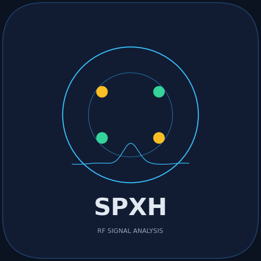
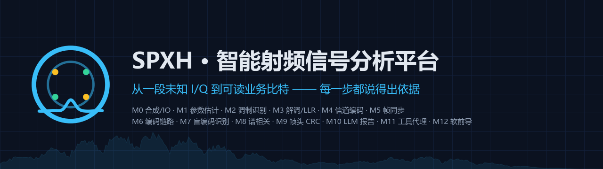

<div align="center">



# SPXH · 智能射频信号分析平台

**Smart RF Signal Analysis Platform**

从一段**未知 I/Q** 到**可读业务比特** —— 每一步都说得出依据

盲参数估计 · 调制识别 · 解调与软信息 · 信道编码 · 帧同步 · 盲编码识别 · 谱相关 · LLM 报告 · 工具调用代理

[](https://github.com/WmjXiaoJun/SPXH/actions/workflows/ci.yml)


[本项目 GitHub](https://github.com/WmjXiaoJun/SPXH) ·
[快速启动](#快速启动) ·
[全部功能](#全部功能) ·
[实测数据](#实测数据) ·
[工作台](#web-工作台) ·
[路线图](#路线图) ·
[致谢](#致谢)

**简体中文** · [English](README.en.md)

[快速启动](#快速启动) · [全部功能](#全部功能) · [实测数据](#实测数据) · [工作台](#web-工作台) · [自检脚本](#验收自检脚本) · [项目结构](#项目结构) · [诚实边界](#设计取舍--诚实边界) · [常见问题](#常见问题)

</div>



> 仓库地址：[WmjXiaoJun/SPXH](https://github.com/WmjXiaoJun/SPXH)。如果你 fork 了本项目，记得把徽章与本文件里的账号换成你自己的。
> 所有实测数字都能由 `scripts/check_*.py` 重放，逐条溯源记录见 [docs/开源检查清单.md](docs/开源检查清单.md)。

---

## 这是什么

SPXH 只解决一个问题：

> 手上只有一段**不知道制式、不知道符号速率、不知道有没有纠错**的 I/Q 数据，
> 怎么把它解成可读的比特和载荷，而且**每一步都拿得出证据**？

它把这件事拆成一条确定性流水线，每一级只做一件事，并把自己的中间量
（置信度、证据、同步轨迹、CRC 状态、锁定指示、软信息）暴露出来：

```text
M0 合成/IO → M1 参数估计 → M2 特征+调制识别 → M3 解调/LLR → M4 信道编码
          → M5 帧同步/载荷 → M6 编码链路 → M7 盲编码识别与擦除译码 → M8 谱相关
          → M9 帧头 CRC/盲长度恢复 → M10 LLM 报告（可配置、不许编数） → M11 工具调用代理
          → M12 软前导（低信噪比召回）与联合译码入链路
```

### 里程碑一览

| 里程碑 | 解决什么 | 关键能力（模块） | 验收报告 |
|---|---|---|---|
| **M0** | 让整条链路可验证 | 多格式 I/O（RAW/WAV/SigMF/npz）、六类调制合成、损伤注入、真值 sidecar（`core/io`、`core/synth`、`core/framing`） | [M0](docs/M0-验收报告.md) |
| **M1** | 未知 I/Q → 带置信度的参数 | Welch PSD / STFT 瀑布、噪声底与占用带宽、载频、符号速率、盲 SNR（`core/dsp`、`core/estimate`） | [M1](docs/M1-验收报告.md) |
| **M2** | 参数 → 制式 | 五域 23 维特征、按 SNR 分区的随机森林、概率校准、置信度门控、物理规则回退、OOD（`core/features`、`core/classify`） | [M2](docs/M2-验收报告.md) |
| **M3** | 制式 → 判决符号与软信息 | Gardner 定时环、判决导向载波环、六类解调、max-log LLR、锁定指示与同步轨迹（`core/demod`） | [M3](docs/M3-验收报告.md) |
| **M4** | 软信息 → 更可靠的比特 | 交织、Viterbi（硬/软）、RS(255,223)、CCSDS 级联、LDPC 归一化最小和（`core/fec`） | [M4](docs/M4-验收报告.md) |
| **M5** | 符号流 → 帧与载荷 | Barker-13 前导同步、相位模糊求解、帧头解析、CRC-16 校验、载荷提取（`core/framesync`） | [M5](docs/M5-验收报告.md) |
| **M6** | 编码链接进帧结构 | 成帧 / 解交织 / 软判决译码 / CRC 端到端打通；CRC 放进编码内（`core/fec/codec.py`、`core/framing/format.py`） | [M6](docs/M6-验收报告.md) |
| **M7** | 平滑曲线与「不信帧头」 | 每点多帧的端到端曲线、盲编码识别（假设 + 重写帧头 + CRC 校验）、RS 擦除译码 | [M7](docs/M7-验收报告.md) |
| **M8** | 擦除 + 未知错误；可解释性 | RS 误差 + 擦除联合译码、SSCA 谱相关双频平面、案例数据集扩到 32 个（`core/explain`） | [M8](docs/M8-验收报告.md) |
| **M9** | 帧头自身的保护 | 帧头 CRC-8（4→5 字节）、载荷长度盲恢复、LLM 分析报告层（`core/report/narrator.py`） | [M9](docs/M9-验收报告.md) |
| **M10** | LLM 可信可控 | 三级配置优先级（file > env > default）、脱敏回显、字段校验、密钥只落本地、报告数字逐个溯源（`core/report/llm_config.py`） | [M10](docs/M10-验收报告.md) |
| **M11** | 让模型自己决定「看什么」 | 工具调用代理（9 工具、有界循环、去重、离线确定性回退）、访问令牌、密钥 DPAPI 加密（`core/agent`、`web/auth.py`） | [M11](docs/M11-验收报告.md) |
| **M12** | 低信噪比召回与联合译码入链路 | 软前导判决、LLR 擦除联合译码、**突发检测（塌陷/压制）与自动擦除（CRC 仲裁）**、代理批量巡检与译码工具 | [M12](docs/M12-验收报告.md) |

**纯 Python，核心只依赖 numpy + scipy**（分类器额外需要 scikit-learn，出图需要 matplotlib）。
12 个里程碑各有一份**可复跑的验收报告**，报告里的每个数字都能被对应脚本重放。

## 快速启动

### 1. 安装

```bash
git clone https://github.com/WmjXiaoJun/SPXH.git      # 或直接下载 ZIP
cd SPXH
python -m venv .venv
# Windows:  .\.venv\Scripts\Activate.ps1
# Linux/mac: source .venv/bin/activate
python -m pip install -U pip
python -m pip install -e ".[dev,ml,plot]"        # 或者：pip install -r requirements.txt
```

> 最小可跑依赖是 **numpy + scipy**；调制识别需要 scikit-learn（`.[ml]`）；出图需要 matplotlib（`.[plot]`）——缺失时脚本与对应测试会**跳过出图**，不影响判据。

>
> **⚠️ 分类器模型（59 MB）不随仓库分发。** 克隆后先跑一次重建（约 1 分钟），调制识别才能走 ML 判决：
>
> ```bash
> python scripts/train_classifier.py
> ```
>
> 不跑也能用：`classify` 会自动退回**物理规则**（门控显示 `fallback`）并明确告警「未找到训练好的模型」；
> 参数估计 / 解调 / 帧同步 / 译码 / 谱相关与全量测试都不受影响（411 项测试在无模型下实测全过）。

### 2. 四条命令，从生成到"读出东西"

```bash
# ① 生成一段带完整真值的信号（M0）
python -m spxh generate --mod qpsk --snr 10 --out data/qpsk_snr10

# ② 盲参数估计：载频 / 符号速率 / 盲 SNR，有真值会自动对账（M1）
python -m spxh analyze data/demo/qpsk_snr+10.0_000.sigmf-meta

# ③ 帧同步 + 译码 + CRC + 载荷提取，一条命令走完（M5/M6/M8/M9）
python -m spxh frame data/demo/qpsk_conv_snr+10.0_000.sigmf-meta --blind

# ④ 工具调用代理：让模型自己决定先看谱相关还是先解帧（M11，没有 API key 时走离线确定性计划）
python -m spxh agent data/demo/qpsk_snr+10.0_000.sigmf-meta --goal "这是什么制式？能不能读出载荷？"
```

`data/demo/` 已内置 **32 个案例**（六类调制 × 四档信噪比 + 编码链路案例），
不用先生成就能直接跑 ②③④。

### 3. 打开图形工作台

```bash
python -m spxh serve        # 浏览器打开 http://127.0.0.1:8760/
```

### 4. 跑验收与测试

```bash
python -m pytest -q                       # 全量测试（输出长时重定向到文件：> pytest.log 2>&1）
python scripts/check_m0.py                # 合成链自校验
python scripts/check_m5.py                # 帧同步 + 载荷还原
python scripts/check_m12.py --part recall # 低信噪比帧召回（软前导）
```

---

## 全部功能

下面按"数据怎么流动"的顺序，把每个功能讲清楚：**它做什么、怎么用、输出什么、边界在哪**。
每一节末尾的链接是该项的验收报告（含实测数字与复现命令）。

### 1. 数据与真值：让整条链路可验证（M0）

**做什么**：读/写四种数据格式，并能**合成**带完整真值的信号——没有真值，后面所有"精度""误码率"
都无从谈起。

- **格式**：RAW（裸复数采样）、WAV、**SigMF**（元数据 + 数据两个文件）、npz；
- **合成**：BPSK / QPSK / 8PSK / 16QAM / 2FSK / 4FSK，RRC 成型（默认滚降 0.35、跨度 16 符号），
  可选注入 **AWGN、载波频偏、相位噪声、IQ 不平衡、DC 偏置**；
- **成帧**：Barker-13 前导 + 5 字节帧头（含 CRC-8）+ 载荷 + CRC-16；
- **真值 sidecar**：`*.truth.json` 记录每比特、每符号、每帧载荷与全部信道参数，
  随机数完全由 seed 驱动（同一 seed 必得同一波形）。

```bash
python -m spxh generate --mod 16qam --snr 8 --fec ldpc --payload-len 64 --frames 8 --out data/mine
python -m spxh dataset  --out data/grid --mods bpsk,qpsk,8psk --snrs 0,10,20   # 批量造数据集
python -m spxh info     data/demo/qpsk_snr+10.0_000.sigmf-meta                 # 看元信息
```

**边界**：真值是"理想接收端"意义下的真值；合成信道不含多径与非线性。
详见 [M0 验收报告](docs/M0-验收报告.md)。

### 2. 盲参数估计：先知道"它有多快、偏了多少"（M1）

**做什么**：在不知道任何参数的条件下估计 **Es/N0、载频偏移、符号速率**，并给出**置信度与方法**。

- Welch PSD + STFT 瀑布、噪声底与占用带宽；
- 载频：平顶谱用峰值不可靠，实际用**谱对称性/重心**类判据（这条踩坑写在报告里）；
- 符号速率：循环平稳/谱线类判据；
- 盲 SNR：基于噪声底与信号功率，实测与定义值最大偏差 **< 0.06 dB**。

**输出**：每个估计都是 `{value, unit, confidence, method, evidence}` —— 这正是后面 LLM 报告能"只引用不编造"的基础。

**实测**：最差载频误差 **10.5 Hz（0.85% Rs）**、符号速率相对误差 **1.3e-4**、Es/N0 误差 **0.16 dB**。

**边界**：载频精度约 1% Rs，够捕获、不够做秒级相干处理 —— 所以 M3 必须有跟踪环。
详见 [M1 验收报告](docs/M1-验收报告.md)。

### 3. 特征与调制识别：说出"这是什么制式"（M2）

**做什么**：把信号变成 **五域 23 维特征**，用**按 SNR 分区的随机森林**分类，并给出**校准过的概率**。

- 五域：瞬时统计、谱形状、高阶累积量、星座几何、循环平稳；
- **置信度门控**：概率不够高就拒绝作答（`reject`），或退回**物理规则**（`fallback`），
  只有在有把握时才走机器学习判决（`ml`）；
- **OOD 检测**：判断样本是否超出训练分布；
- 概率**校准**（ECE 0.087 @SNR≥5 dB），所以界面上的"置信度"是可以当概率读的。

**实测**：识别准确率 **1.000 @20 dB / 0.900 @10 dB**；走 ML 判决的样本错误率 0.057；OOD 检出率 0.594。

```bash
python -m spxh features  data/demo/qpsk_snr+10.0_000.sigmf-meta   # 看 23 维特征
python -m spxh classify  data/demo/qpsk_snr+10.0_000.sigmf-meta   # 制式 + 概率 + 门控
python scripts/train_classifier.py                                # 首次使用请跑：重建 59 MB 分类器模型（未随仓库分发）
```

**边界**：分类器只在**合成数据**上训练；0 dB 以下基本不可用；对"同族但参数偏移"的 OOD 不敏感。
详见 [M2 验收报告](docs/M2-验收报告.md)。

### 4. 解调与软信息：把符号变成"带可信度的比特"（M3）

**做什么**：**Gardner 定时环 + 判决导向载波环**做同步，六类调制判决，并输出 **max-log LLR**。

- 同步环有**锁定指示**（定时/载波各自的度量）与**收敛轨迹**，界面上能直接看到"到底锁没锁"；
- 输出软信息（LLR），约定 **正 ⇒ 更可能是 0**，一路贯穿到 FEC 译码器；
- LLR 经过**校准对账**：5 dB 时理论期望误码数 69.5，实测 69（比值 0.99）。

**实测**：QPSK 相对"无跟踪基线"的 BER **4.95e-1 → 9.2e-4（改善 537 倍）**；16QAM **4.21e-1 → 1.0e-3（406 倍）**。

```bash
python -m spxh demod data/demo/qpsk_conv_snr+10.0_000.sigmf-meta
```

**边界**：8PSK/16QAM 有**误码地板**（同步环残余抖动导致，不是噪声）。详见 [M3 验收报告](docs/M3-验收报告.md)。

### 5. 信道编码与译码：软信息换可靠性（M4）

**做什么**：六种方案编/译码，并量化"到底赚了多少"。

| 方案 | 说明 | 实测 |
|---|---|---|
| 矩阵/卷积交织 | 把突发打散 | 32 符号突发：不交织不可纠，交织后每码字最多 7 错全部纠正 |
| 卷积码 + Viterbi | 硬判决 / **软判决** | 软判决相对硬判决 **+2.92 dB @1e-4** |
| RS(255,223) | BM + Chien + Forney | 纠错上限 t 实测符合理论 |
| **RS 误差+擦除联合译码** | 2f + e ≤ 2t | 8 擦除+4 错误（=16）还原；4 擦除+7 错误（18）如实报不可纠 |
| CCSDS 级联 | RS × 卷积，保留级联结构与增益量级 | 端到端门限最优（见第 7 节） |
| LDPC(1152,578) | Gallager 正则短码 + 归一化最小和 | 秩 574、码率 0.5017（如实上报） |

**边界**：CCSDS/LDPC 是"同类结构 + 同量级增益"的实现，**不能与真实设备互操作**。
详见 [M4 验收报告](docs/M4-验收报告.md)、[M8 验收报告](docs/M8-验收报告.md)。

### 6. 帧同步与载荷提取：从符号流里"认出帧"（M5）

**做什么**：用 **Barker-13 前导**做相关同步，解**相位模糊**，解析帧头，校验 **CRC-16**，取出载荷。

- 同步不用真值：只靠前导与帧结构；
- **相位模糊**由前导自身解出（BPSK 2 种、QPSK 4 种对称旋转都能自纠）；
- 载荷可**逐字节**与真值对账（`payload_bytes_exact`）。

**实测**：15 dB 起 BPSK/QPSK **8/8 帧 CRC 通过、载荷逐字节一致**。

```bash
python -m spxh frame data/demo/qpsk_snr+10.0_000.sigmf-meta
```

**边界**：低信噪比下召回有限（见第 12 节的软前导改进）。详见 [M5 验收报告](docs/M5-验收报告.md)。

### 7. 编码链路：把编码接进帧结构，量出真实增益（M6/M7）

**做什么**：把 M4 的编码/译码接进 M5 的帧结构，在**含同步与估计误差**的条件下测端到端 CRC 门限。

- 关键决定：**CRC 放进编码里**（校验字段自己受保护），只留帧头不编码；
- **平滑曲线**：每个信噪比点跑多帧，门限用线性插值，不用 4 帧的粗量化；
- **盲编码识别**：帧头里的 `fec` 字段被打错（谎报"无编码"）时，用「假设 → **重写帧头 fec 位** → CRC 校验」
  把 conv/rs/ccsds/ldpc 四种全部认回来（关键点：必须同时修正帧头，否则 CRC 永远对不上）。

**实测**：无编码 **11.20 dB** → CCSDS 级联 **6.90 dB**，**门限改善 4.30 dB**。

```bash
python scripts/check_m6.py                    # 编码链门限 + 交织对照
python scripts/check_m7.py --part curves      # 平滑端到端曲线
python scripts/check_m7.py --part blind       # 盲编码识别
```

### 8. 帧头自校验与"长度也能盲恢复"（M9）

**做什么**：帧头 4 → **5 字节**，第 5 字节是前 4 字节的 **CRC-8**。

- 帧头被打错**立刻可见**；
- 连**载荷长度字段被打错**也能恢复：对 (编码, 交织, 长度) 的假设重写帧头，用 CRC-8 过滤候选，
  再用帧内 CRC-16 终判；
- 帧头不可信时，序列推进改用**最近一次可信帧长**，不会被垃圾长度带跑偏。

**实测**：五种编码在长度字段被改坏后**全部恢复**；8 dB 下帧召回 卷积 **5/16 → 11/16**、CCSDS **4/16 → 12/16**。

### 9. 谱相关（SSCA）：一张"看得见的证据"（M8）

**做什么**：算 **循环谱双频平面** `S_x^α(f)` —— 通信信号循环平稳，成型脉冲会在
**α = 符号速率及其谐波**处成脊，载频偏移体现在 **f 轴**；白噪声只在 α=0 有能量。

- **α 轴峰 = 符号速率**（实测 1000.0 Hz，真值 1000 Hz，分辨率 fs/nfft = 31.25 Hz）；
- **α≠0 脊线的 f 位置 = 载频偏移**（一个分辨 bin 之内）；
- 与 M1 的精确估计**并排对照**展示，"两条独立证据是否一致"一眼可见。

**踩坑记录**：α 轴尺度差 2 倍（SSCA 两路频谱各偏 α/2）；CFO 不能用 α=0 那行取峰（那是平顶功率谱）。

### 10. LLM 报告层：让模型"只解释、不估算"（M9/M10）

**做什么**：把整条链路的**结构化证据**交给 LLM，生成分析师视角的中文报告；**没有 key 时走离线确定性渲染**。

- **分工**：所有数字来自确定性管线（带 `source/unit/confidence`），模型只做解释、整合、找矛盾、给建议；
- **不许编数**：提示词硬性要求"只引用给定字段，缺就写 null"，报告还要过**数值落地检查**
  （正文每个数字都要能在证据表里溯源，白名单就是"模型实际看到的那份 JSON"）；
- **可自定义**：配置优先级 **本地文件 `models/llm_config.json` > 环境变量 `SPXH_LLM_*` > 默认**，
  每项都回报来源；**密钥只落本地、接口只回显尾 4 位**，Windows 上用 **DPAPI 加密**（老明文配置自动迁移）；
- **服务商预设**：DeepSeek / OpenAI / 本地 Ollama / 自定义一键填充；base_url 自动归一化；
  遇到不支持 JSON 模式的模型（如 `deepseek-reasoner`）会**自动降级重试**。

```bash
python -m spxh narrate data/demo/qpsk_conv_snr+10.0_000.sigmf-meta          # 离线报告（确定性）
python -m spxh llm --set base_url=https://api.deepseek.com --set model=deepseek-chat --set api_key=sk-xxx --test
```

**实测**：离线报告正文 **26 个数字全部可溯源**；伪造的数字会被准确标出。

### 11. 工具调用代理：让模型自己决定"下一步看什么"（M11/M12）

**做什么**：把管线能力暴露成 **9 个工具**，模型自主多轮探查，平台硬控预算。

| 工具 | 作用 |
|---|---|
| `analyze` | M1 参数（Es/N0、载频、符号速率 + 置信度） |
| `classify` | M2 制式、门控、OOD |
| `spectrum` | 功率谱与谱峰 |
| `demod` | M3 锁定状态、符号数、EVM、BER |
| `frame` | M5/M9 同步、帧头 CRC、载荷、盲恢复 |
| `decode` | 完整接收链 + 译码统计（纠正符号数、不可纠帧、自动擦除数） |
| `ssca` | M8 谱相关（α 峰 / 脊线） |
| `batch` | 批量巡检多个案例，输出横向对照表 |
| `cases` | 案例清单 |

**三条硬约束**：① **有界** —— 轮数（6/12）、工具调用（12/24）、墙钟（120/300 s）三重上限，
触顶即停并如实回报 `stop_reason`；② **同工具同参数重复调用直接拒绝**（防模型空转烧钱）；
③ **事实只能来自工具** —— 结论要过数值落地检查。

**真机实测（DeepSeek）**：4 轮 / 7 次调用 / 22.5 s。模型自己先去拿参数与谱相关，然后**主动对比
"开盲恢复 vs 不开"的帧提取结果**（5/6 vs 4/6 帧 CRC 通过），最后给出可溯源结论 ——
这就是代理相对"一次性总结"的价值。

```bash
python -m spxh agent <path> --goal "..."   # 有 key 走 LLM，没 key 走离线确定性计划
python -m spxh agent --tools               # 只看工具清单与预算
```

### 12. 低信噪比帧召回：软前导判决（M12）

**做什么**：低信噪比下帧召回的瓶颈不是相关峰不够高，而是**解析阶段要求 13 位 Barker 全对**。
改成**软判决**：最多容忍 2 位不符 **且** 软相关为正，误判由帧头 CRC-8 与帧 CRC-16 两级兜底。

**实测**（16 帧 QPSK）：卷积 6 dB **4/4 → 10/10**、10 dB **13/13 → 16/16**；CCSDS 8 dB **12/10 → 14/11**。
无编码链路几乎不变（它没有冗余，失败在载荷 CRC）——如实记录。

**同一轮还测了一条反直觉结论**：把"|LLR| 低就标擦除"接进链路后，纯 AWGN 下门限**反而变差**
（8.78 → 9.20 dB），因为低 |LLR| 的符号大多是**正确**的，而每个错误擦除要吃掉半个纠错能力。
改成**只标连续成段（≥3 符号）的弱区**后：AWGN 下与不标擦除**逐点相同**、自动擦除数 **0 个**；
已知位置的突发（9/12/16 字节）仍然**全部通过**。一句话：**擦除信息值钱的是"位置可信"，不是"置信度低"**。

### 12.1 突发检测 + 自动擦除（M12-C）

**做什么**：从**信号侧**自动找"这一段不可信"，把位置交给联合译码，全程不用人告诉它坏在哪。

- **检测**：滑动 RMS + 双判据（深度 < -12 dB 且低于中位数 - 4×MAD），识别两类损伤 ——
  **collapse**（遮挡/置零/深衰落）与 **jam**（压制/强干扰，功率抬升 ≥6 dB）；干净信号与纯噪声**零假报**；
- **映射**：定时环暴露每个符号的采样位置（`symbol_samples`），突发区间 → 符号 → 帧内比特 → RS 符号下标；
- **仲裁**：候选擦除预算逐个试，**CRC 说了算**（预算里含 0）→ **自动擦除永不比不标更差**（实测 11/11 场景不退化）。

**实测结论（诚实版）**：检测与链路都可用，但**本配置下没有帧级增益** —— 局部突发要么落在 RS 的 t=8 余量内，
要么强到连同步环一起打掉（损伤扩散到整帧，远超 2t）。**瓶颈在同步环而不是译码器**，所以下一步是同步侧抗突发。
另外：遮挡式置零对 QPSK 其实是**很弱**的损伤（零点落到固定判决点，20 个符号里约 8 个真出错），
用它做突发实验会得到"系统很鲁棒"的假象 —— 这组对照也保留在报告里。

**同步侧抗突发（M13 尝试）**：检测到的区间会先**置零**（不让强干扰经匹配滤波污染环路），
并在突发期间**冻结定时/载波环**（按当前状态滑行），出突发后仍保持锁定。
实测结论同样诚实：**机制生效但不产生帧级增益** —— RRC 匹配滤波把一个 20 符号的洞展宽到约 36 个符号的有效损伤，
超过 RS(78,62) 的 2t = 16 预算；强干扰还会直接打掉前导相关（整个记录只剩 0~2 帧能被解析）。
于是本轮明确了硬约束：**有效损伤必须 ≲ 2t，擦除才有用武之地**。

```bash
python scripts/check_m12.py --part burst     # 检测 / 仲裁 / 同步抗突发 / 低信噪比窗口
python -m pytest tests/test_burst.py -q      # 9 项（含环路冻结机制与"不帮倒忙"性质）
```

详见 [M12 验收报告](docs/M12-验收报告.md)。

<a id="web-工作台"></a>

### 13. Web 工作台（11 个标签页）

```bash
python -m spxh serve            # http://127.0.0.1:8760/（默认只监听回环）
```

| 标签页 | 你能看到什么 |
|---|---|
| 频谱 / 瀑布 | PSD、噪声底、占用带宽、时频瀑布（可滚轮缩放、拖动平移） |
| 参数估计 | 载频 / 符号速率 / 盲 SNR + 置信度 + 与真值对照 |
| 特征 | 23 维特征分组可视化 |
| 识别 | 制式、概率分布、门控与 OOD 判据 |
| 解调 | 锁定指示、同步轨迹、星座、判决前/后对比 |
| 译码 | BER 曲线、软/硬判决对照、各编码方案 |
| 帧 | 帧头 CRC 三态、载荷预览、盲恢复读数、相关峰 |
| 谱相关 | SSCA 热图 + α/f 剖面 + 峰值表（谱相关 vs M1 估计并排） |
| 报告 | LLM/离线分析报告：结论 + **逐条证据表** + 不确定项 + 建议 + 提示词回看 |
| 代理 | 工具调用时间线（每轮调了什么、耗时、结果）、最终结论、运行摘要、数值落地检查 |
| 设置 | LLM 配置（服务商预设、测连接、拉模型列表、清密钥）+ 访问令牌 |

- **所有图表都可交互**：滚轮缩放（以鼠标为锚点）、Shift 只缩 X / Alt 只缩 Y、拖动平移、双击复位；
- 逐请求日志默认写 `models/web.log`（不刷 stdout），前台调试加 `--verbose`；
- 页面内失败态都有明确文案，不会静默停在"加载中"。

**对外暴露时要加令牌**：`python -m spxh serve --token auto`（会打印令牌，前端在「设置」页填入）。
默认策略：只监听回环且未设令牌 → 不鉴权；**监听非回环却没设令牌 → 一律拒绝**。

### 14. 命令行（15 个子命令）

```text
generate  dataset  info  spectrum  analyze  features  classify  demod
frame     fec      narrate  agent  llm      serve     mods
```

每个子命令都有 `--help`，多数支持 `--json`（便于脚本消费）。

---

## 实测数据

下表只摘录**报告里已经写着**的数字，并标注出处；重新跑对应的 `scripts/check_*.py` 可以复现。

| 里程碑 | 指标 | 实测 | 出处 |
|---|---|---|---|
| M0 | 30 dB 的 EVM（BPSK/QPSK/8PSK/16QAM） | 约 3.1%（纯噪声理论值 3.16%） | [M0 §4.1](docs/M0-验收报告.md) |
| M0 | 10 dB 的 BER：BPSK / QPSK / 8PSK / 16QAM / 2FSK / 4FSK | 0 / 0 / 3.1e-2 / 6.1e-2 / 2.3e-3 / 3.0e-2 | [M0 §4.1](docs/M0-验收报告.md) |
| M0 | 实测噪声方差与 Es/N0 定义的最大偏差 | < 0.06 dB | [M0 §4.2](docs/M0-验收报告.md) |
| M1 | 最差载频估计误差（SNR ≥ 10 dB） | 10.5 Hz（0.85% Rs） | [M1 §3.1](docs/M1-验收报告.md) |
| M1 | 最差符号速率相对误差 | 1.3e-4（0.013%） | [M1 §3.1](docs/M1-验收报告.md) |
| M1 | 最差 Es/N0 误差 | 0.16 dB | [M1 §3.1](docs/M1-验收报告.md) |
| M2 | 调制识别准确率 @20 dB / @10 dB | 1.000 / 0.900 | [M2 §3.4](docs/M2-验收报告.md) |
| M2 | 概率校准 ECE（SNR ≥ 5 dB） | 0.087 | [M2 §3.4](docs/M2-验收报告.md) |
| M2 | OOD 检出率 | 0.594 | [M2 §3.4](docs/M2-验收报告.md) |
| M3 | QPSK：无跟踪基线 vs 接收链 BER | 4.95e-1 → 9.2e-4（改善 537 倍） | [M3 §2.1](docs/M3-验收报告.md) |
| M3 | 16QAM：无跟踪基线 vs 接收链 BER | 4.21e-1 → 1.0e-3（改善 406 倍） | [M3 §2.1](docs/M3-验收报告.md) |
| M3 | LLR 校准（5 dB：期望/实测误码数） | 69.5 / 69（比值 0.99） | [M3 §3.2](docs/M3-验收报告.md) |
| M4 | 软判决相对硬判决的增益 | 2.92 dB @ BER=1e-4；2.33 dB @ 1e-3 | [M4 §3.2](docs/M4-验收报告.md) |
| M4 | 32 符号突发的交织价值 | 不交织不可纠；深度 5 符号交织后每码字最多 7 错，全部纠正 | [M4 §3.3](docs/M4-验收报告.md) |
| M5 | 15 dB 起 BPSK/QPSK 的 8 帧结果 | 8/8 帧 CRC 通过、载荷逐字节一致 | [M5 §3.1](docs/M5-验收报告.md) |
| M6 | 编码链把 CRC 可用门限拉低 | 无编码 11.8 dB → 卷积(软)/LDPC 7.8 dB（改善 4.0 dB） | [M6 §3.2](docs/M6-验收报告.md) |
| M6 | 32 比特突发：卷积不交织 vs 交织 | 0/8 → 8/8 | [M6 §3.3](docs/M6-验收报告.md) |
| M7 | 平滑端到端门限（每点 16 帧复测） | 无编码 11.20 dB → CCSDS 级联 6.90 dB（改善 4.30 dB） | [M7 §2](docs/M7-验收报告.md) |
| M7 | 盲编码识别（帧头 fec 字段被打成 0） | conv / rs / ccsds / ldpc 四种全部恢复，载荷一致 | [M7 §3](docs/M7-验收报告.md) |
| M7 | RS 擦除译码（RS(76,60)，t=8） | 9/12/16 字节突发通过、17 字节如实报不可纠（**已复跑 PASS**） | [M7 §4](docs/M7-验收报告.md) |
| M8 | RS 误差 + 擦除联合译码（2f+e ≤ 16） | 8 擦除+4 错误还原；4 擦除+7 错误（18>16）如实报不可纠 | [M8 §2](docs/M8-验收报告.md) |
| M8 | SSCA 谱相关的 α 轴峰 | 1000.0 Hz（真值 1000 Hz；分辨率 31.25 Hz） | [M8 §3](docs/M8-验收报告.md) |
| M8 | 案例数据集规模 | 32 个（六类调制 × 四档 SNR + 编码链路案例） | [M8 §4](docs/M8-验收报告.md) |
| M9 | 帧头 CRC-8 + 长度盲恢复 | 五种编码在长度字段被改坏后全部恢复 | [M9 §2](docs/M9-验收报告.md) |
| M9 | 8 dB 的帧召回（16 帧，blind=1） | 卷积 5/16 → 11/16；CCSDS 4/16 → 12/16 | [M9 §2](docs/M9-验收报告.md) |
| M10 | 离线报告的数值可溯源 | 正文 26 个数字全部可溯源（`grounded: true`） | [M10 §5](docs/M10-验收报告.md) |
| M11 | 代理真机实测（DeepSeek） | 3 轮 / 6 次工具调用 / 12.2 s，结论数字全部可溯源 | [M11 §2](docs/M11-验收报告.md) |
| M11 | 访问令牌策略 | 回环且未设令牌 → 不鉴权；非回环未设令牌 → 一律拒绝 | [M11 §3](docs/M11-验收报告.md) |
| M12 | 软前导对编码链路召回的提升（16 帧；数值 = 解析帧数 / CRC 通过帧数） | 卷积 6 dB 4/4 → **10/10**；10 dB 13/13 → **16/16**；CCSDS 8 dB 12/10 → **14/11** | [M12 §2](docs/M12-验收报告.md) |
| M12 | 擦除译码的克制策略 | AWGN 下与不标擦除逐点相同（门限 8.78 dB）、自动擦除 0 个；已知位置突发 9/12/16 字节全过 | [M12 §4](docs/M12-验收报告.md) |
| 全局 | 测试 | 33 个测试文件 / 411 个用例（`pytest --collect-only`，本次核对） | [开源检查清单](docs/开源检查清单.md) |

---

## 项目结构

```text
SPXH/
├─ spxh/                         主包（可 pip install）
│  ├─ cli/main.py                15 个子命令：generate/dataset/info/spectrum/analyze/features/
│  │                             classify/demod/frame/fec/narrate/agent/llm/serve/mods
│  ├─ core/
│  │  ├─ types.py bits.py        核心类型（Signal/FrameRecord/GroundTruth）与 MSB-first 比特打包
│  │  ├─ io/                     RAW / WAV / SigMF / npz 多格式读写（M0）
│  │  ├─ synth/                  六类调制合成、RRC 成型、损伤注入、数据集生成（M0）
│  │  ├─ framing/                Barker-13、帧结构、CRC-16/CRC-8、帧头假设重写（M0/M5/M9）
│  │  ├─ dsp/                    Welch PSD、STFT 瀑布（M1）
│  │  ├─ estimate/               载频 / 符号速率 / 盲 SNR 估计（M1）
│  │  ├─ features/               五域 23 维特征（M2）
│  │  ├─ classify/               分区随机森林 + 概率校准 + 门控 + 物理规则回退（M2）
│  │  ├─ demod/                  定时环 + 载波环 + 多体制判决 + max-log LLR（M3）
│  │  ├─ fec/                    交织 / Viterbi / RS / CCSDS / LDPC / 联合译码（M4/M6/M8/M12）
│  │  ├─ framesync/              前导同步 + 相位模糊 + 载荷提取 + 盲恢复（M5/M6/M7/M9）
│  │  ├─ explain/                SSCA 谱相关（M8）
│  │  ├─ report/                 LLM 报告层、可配置 LLM、DPAPI 密钥加密（M9/M10/M11）
│  │  └─ agent/                  工具调用代理：工具集 + 有界循环（M11/M12）
│  ├─ web/                       本地 Web 工作台（stdlib HTTP 服务 + 无构建前端）
│  └─ tools/                     理想参考接收端、出图工具
├─ scripts/                      验收自检：check_m0..m12.py；分类器训练 train_classifier.py
├─ tests/                        pytest：33 个文件 / 411 个用例
├─ models/                       分类器元数据 + 验收报告 JSON（59 MB 的 .joblib 模型未随仓库分发；llm_config.json / web.log 已忽略）
├─ data/demo/                    32 个案例：SigMF 元数据 + 数据 + 真值 sidecar
├─ docs/                         里程碑验收报告、实现方案、前端文档、开源检查清单、插图
├─ .github/workflows/ci.yml      CI：ubuntu + windows 双平台跑 pytest 与验收脚本
├─ requirements.txt              pip install -r 入口（与 pyproject.toml 一致）
└─ LICENSE (MIT) / CONTRIBUTING.md
```

## 验收自检脚本

每个脚本打印一张人可读的表 + 一份 `[PASS]/[FAIL]` 清单，并把结构化结果写进 `models/check_*.json`；
**全过返回 0，任一不过返回 1**（CI 看退出码）。

| 脚本 | 证明什么 | 大致耗时 |
|---|---|---|
| `python scripts/check_m0.py` | 合成链正确：理想参考接收端的 BER/EVM、帧 CRC、可复现性 | 秒级 |
| `python scripts/check_m1.py` | 参数估计精度 + 「估计误差 → EVM/BER」因果曲线（并出图） | 十秒级 |
| `python scripts/check_m2.py` | 分类准确率、门控行为、概率校准（ECE）、OOD 检出 | 约 1 分钟 |
| `python scripts/check_m3.py` | 六类调制 BER、同步环相对无跟踪基线的价值、LLR 校准对账 | 约 1 分钟 |
| `python scripts/check_m4.py` | 六种编码方案的 BER 曲线、软判决增益、RS 纠错上限、交织价值 | 约 3~5 分钟 |
| `python scripts/check_m5.py` | 帧同步率、前导解相位模糊、载荷逐字节还原、低信噪比 CRC 失败率 | 十秒级 |
| `python scripts/check_m6.py` | 编码链端到端 CRC 门限与载荷一致率、交织对照实验 | 约 2 分钟 |
| `python scripts/check_m7.py --part curves` | 平滑端到端门限曲线（每点 16~24 帧） | 约 3.5 分钟 |
| `python scripts/check_m7.py --part blind` | 盲编码识别（四种编码，帧头 fec 字段谎报） | 秒级 |
| `python scripts/check_m7.py --part erasure` | RS 擦除译码把纠错能力从 t 翻倍到 2t | 秒级（**PASS**） |
| `python scripts/check_m12.py --part recall` | 软前导对低信噪比帧召回的提升（硬前导对照） | 约 3 分钟 |
| `python scripts/check_m12.py --part erasure` | 联合译码入链路：AWGN 不退化 + 不虚标擦除 | 约 1 分钟 |

## 设计取舍 / 诚实边界

这一节汇总各份报告里的「已知局限」。它们不是待办清单，而是**当前版本真实的能力边界**：

- **8PSK / 16QAM（以及 QPSK 约 1e-3 量级）存在误码地板。** 来源是同步环残余抖动而不是噪声：
  QPSK 20 dB 实测 9.2e-4、8PSK 5.4e-3（[M3 §5](docs/M3-验收报告.md)）。16QAM 更严重：注入 0.35 符号偏移后
  30 dB 仍有 2125 个比特错误、15 dB 是 2112 个，**与噪声无关**，已按实测依据降级为 known-limit（[M9 §3](docs/M9-验收报告.md)）。
- **低信噪比帧召回靠"软前导"改善，但仍有上限。** M12 把解析阶段从"13 位全对"改成软判决后，
  16 帧里卷积链路 6 dB 能解析的帧从 4 帧提到 10 帧；10 dB 达 16/16。5 dB 依旧很吃力（3 帧），
  因为前导本身只有 6 个符号（QPSK），信息量就那么多（[M12 §2](docs/M12-验收报告.md)）。
- **"跨帧积累"这条路我们试过并放弃了。** 帧周期在符号域是小数（581/2 = 290.5），
  两种盲估计器（|相关| 自相关、峰间隔直方图）在 QPSK 低信噪比下都不可靠，
  估出 22/188/2385（真值 581/290.5/1192.5）。结论写在 [M12 §3](docs/M12-验收报告.md)：
  没有额外先验时，帧周期估计本身就不比帧检测简单 —— 该模块已删除，不留没有实测收益的机制。
- **擦除译码的默认策略是"克制"。** 已知位置时能力翻倍（9~16 字节突发全过）；
  但"|LLR| 低就标擦除"在纯 AWGN 下会把**正确**符号标掉、反而变差（8.78 → 9.20 dB）。
  现在只标**连续成段（≥3 符号）**的弱区：AWGN 下自动擦除数 0 个、与不标擦除逐点相同；
  真正需要它的是遮挡/突发这类**位置可信**的损伤（[M12 §4](docs/M12-验收报告.md)）。
- **M2 分类器只在合成数据上训练与测试。** 0 dB 以下基本不可用；OOD 对「同族、只是参数偏移」不敏感；
  星座特征依赖滚降 0.35 的假设（[M2 §5](docs/M2-验收报告.md)）。
- **M1 的能力边界**：载频精度约 1% Rs，够捕获、不足以支撑秒级相干处理（所以 M3 必须有跟踪环）；
  4FSK(h=0.5) 在 10 dB 时符号速率不可靠，行为是返回低置信度而不是硬答（[M1 §5](docs/M1-验收报告.md)）。
- **LLM 只解释、不估算。** 所有数字来自确定性管线并带 `source/confidence`；报告要过「数值落地检查」；
  没有 key 时走结构一致的离线渲染（[M9 §4](docs/M9-验收报告.md)、[M10 §5](docs/M10-验收报告.md)）。
- **设置接口默认只监听回环。** 只监听 `127.0.0.1` 且未设令牌时不鉴权（本机单人使用）；
  一旦监听非回环地址却没设令牌 → **一律拒绝**；对外用必须加 `--token`（[M11 §3](docs/M11-验收报告.md)）。
- **密钥加密是平台相关的。** Windows 上用 DPAPI（绑定当前用户）加密落盘，老明文配置自动迁移；
  其他平台退回明文并如实标注 `api_key_protected: false`，不假装已加密（[M11 §4](docs/M11-验收报告.md)）。
- **CCSDS 与 LDPC 不是「标准码」。** CCSDS 保留了级联结构与增益量级，但没实现对偶基/随机化，不能与真实设备互操作；
  LDPC 是 Gallager 正则 (1152,578) 短码 + 归一化最小和，实测秩 574、码率 0.5017（如实上报）（[M4 §5](docs/M4-验收报告.md)）。
- **盲识别依赖帧头里的 `payload_len`。** 长度字段可以靠帧头 CRC-8 + 帧 CRC 做假设恢复，
  但这是「有限假设空间」的搜索，不是通用解法（[M7 §6](docs/M7-验收报告.md)、[M9 §2](docs/M9-验收报告.md)）。
- **真实信道不在验证范围内。** 所有结果来自合成信号（AWGN/频偏/相噪/IQ 不平衡/DC 偏置），
  多径、非线性、非白噪声的真实录波尚未验证（[M2 §5](docs/M2-验收报告.md)）。

> **一条已经修掉的"不一致"（保留记录，好让大家相信数字是被核对的）**：
> 开源整理时发现 `check_m7.py --part erasure` 复跑失败，而报告写的是通过。定位为
> **脚本自身的陈旧假设**：里面写死了 `body_start = 13 + 32`（M9 之前的 4 字节帧头），
> M9 把帧头改成 5 字节后，注入的突发落到了错误位置。改成从帧格式常量计算后复跑 **PASS**，
> 报告数字与脚本行为重新一致（[M12 §6](docs/M12-验收报告.md)）。

## 路线图

1. ~~突发检测 + 自动擦除的端到端验证~~ **已完成（M12-C）**；~~同步侧抗突发~~ **也已完成（M13）**：
   置零 + 环路冻结机制生效，但实测无帧级增益，根因是「匹配滤波展宽 + 2t 预算」这条硬约束。
   **下一步优先做「跨码字交织 + 符号级去交织」**：把约 36 符号的有效损伤打散到 5 个 RS 码字上，
   每码字只承担约 7 个错误（在 t=8 之内）—— 这是目前唯一能真正提高突发容量的方向。
   另需排查「交织 × 帧同步」的相互作用（信号级实验里交织布局在高干扰下整段解析失败，尚未定位）。
2. **更长前导作为可选线格式**（+13 比特/帧，检测增益约 3 dB；本轮的软前导已覆盖主要损失）——
   属于「再榨 1~2 dB」的选项，不是必需项。
3. **代理并发化与工具扩展**：`batch` 目前串行（12 个案例偏慢）；计划把译码、联合译码、
   谱相关对照也做成可组合的工作流。
4. **访问令牌的多用户 / 权限分级**（当前单令牌，够本机与内网小范围用）。
5. **LLM 的参数建议与异常解释闭环**：把低置信度、CRC 全灭、门控 fallback 作为上下文，
   输出「下一步调什么」并可直接执行。

## 常见问题

**Q：克隆下来为什么没有分类器模型？**
`models/modulation_rf_v1.joblib` 约 59 MB，超过 GitHub 建议的单文件上限，因此不打进仓库。跑一次
`python scripts/train_classifier.py` 即可重建（约 1 分钟）。不重建也能用 —— 调制识别会自动退回物理规则、把门控标成 `fallback`，
**不会假装自己是模型判决**。

**Q：没有 GPU / 没有数据集能跑吗？**
能。核心只依赖 numpy + scipy，全部在 CPU 上跑；`data/demo/` 自带 32 个案例，
`python -m spxh generate` 还能按需造任意参数的信号与真值。

**Q：必须联网吗？必须配 LLM 吗？**
都不必须。14 个功能里只有"LLM 报告"和"工具调用代理"需要模型；没有 API key 时它们会走
**结构完全一致**的离线确定性路径（代理走固定的 analyze→classify→frame→ssca 计划）。

**Q：支持哪些调制？为什么 8PSK/16QAM 表现差？**
BPSK / QPSK / 8PSK / 16QAM / 2FSK / 4FSK。8PSK/16QAM 的瓶颈是**同步环残余抖动造成的误码地板**
（不是噪声），已经在 [M3 §5](docs/M3-验收报告.md) 量化，并降级为 known-limit；这是诚实的边界，不是一个 bug 掩盖。

**Q：我的 API key 安全吗？**
只落在本地 `models/llm_config.json`（已加入 `.gitignore`），接口**只回显尾 4 位**，
Windows 上以 **DPAPI 密文**存储（绑定当前用户），老明文配置加载时自动迁移。
但请注意：默认不鉴权是"只服务本机"的前提，**要对外暴露必须先 `--token`**。

**Q：这些数字可信吗？会不会是"跑一次好看就写上去"？**
每个数字都能复现：`scripts/check_*.py` 会重新生成表与 JSON 报告，退出码即判据（CI 也跑）。
「实测数据」表里的数字是**自动核对**过的：脚本把每行的数字抽出来，逐个到该行链接的验收报告里查，
**25/25 行命中**；核对脚本本身也随仓库提供（`python scripts/check_readme_numbers.py`，CI 会跑）。

**Q：能对接真实设备 / 真实录波吗？**
能读 SigMF / WAV / RAW / npz 四种录波格式，链路本身与"数据从哪来"无关。
但**当前所有验证都在合成信号上完成**，真实信道的多径、非线性、非白噪声尚未验证（见「诚实边界」）。

## 许可与引用

本项目以 **MIT License** 发布，版权人 `WmjXiaoJun`，年份 2026，完整文本见 [LICENSE](LICENSE)。
你可以自由使用、修改、分发（包括商业用途），只需保留版权与许可声明。

如果 SPXH 对你的工作有帮助，可以这样引用：

```bibtex
@misc{spxh2026,
  title        = {SPXH: Smart RF Signal Analysis Platform},
  author       = {{WmjXiaoJun}},
  year         = {2026},
  howpublished = {\url{https://github.com/WmjXiaoJun/SPXH}},
  note         = {从未知 I/Q 到可读业务比特的端到端射频信号分析实验平台}
}
```

## 致谢

SPXH 是**把公开的信号处理知识工程化的独立实现**，没有复制任何第三方项目代码。
它站在这些早已公开的方法之上：Gardner 定时误差检测与 Farrow 插值、判决导向 / Costas 载波环、
Viterbi 卷积译码、Reed-Solomon 的 BM/Chien/Forney 与误差-擦除联合译码、LDPC 归一化最小和、
Barker 序列与其非周期自相关、CCSDS 级联编码结构、SSCA 条带谱相关、Welch 功率谱估计，
以及随机森林与概率校准等经典机器学习工具。

感谢 numpy / scipy / scikit-learn / matplotlib / pytest 等开源项目提供的工具链。
如果你在报告里发现任何**说不通或复现不了**的数字，欢迎开 Issue —— 这个项目最看重的就是「不黑箱、不编数」。
