# 给你一段看不懂的无线电数据，你能读出里面装的是什么吗？

我给自己出过一道题。

手上只有一个文件：一段 8 kHz 采样的复数基带，4.5 秒长。除此之外什么都不知道——**不知道制式，不知道符号速率，不知道载频偏了多少，不知道有没有纠错码，甚至不确定里面到底有没有帧结构。**

这不是猎奇。这是每次拿到一段陌生录音时的真实状态。

为了把它变成一条**每一步都说得出依据**的流水线，我写了 **SPXH**——一个纯 Python、核心只依赖 numpy + scipy 的射频信号分析平台。这篇文章讲两件事：它是怎么工作的；以及**哪些地方我一开始想错了**。

> 文中每个数字都能被仓库里的 `scripts/check_*.py` 复跑，项目自带 12 份验收报告，逐条标了出处。

---

## 0. 先看答案

把那段数据丢进去，几秒钟后拿到的是这样一份东西：

| 问题 | 答案 | 依据 |
| --- | --- | --- |
| 符号速率多少 | **1000.036 Hz** | 循环平稳/谱线判据；真值 1000 Hz，相对误差 1.3e-4 |
| 载频偏了多少 | **0.98 Hz** | 谱对称性/重心；真值 0 |
| 信噪比多少 | **9.84 dB** | 噪声底 + 信号功率；真值 10 dB |
| 什么制式 | **QPSK**，置信度 0.857 | 五域 23 维特征 + 分区随机森林，概率已校准 |
| 能锁上吗 | 定时锁定 **0.897** / 载波锁定 **0.972** | Gardner 定时环 + 判决导向载波环 |
| 有帧吗 | 有，**8 帧全部 CRC 通过** | Barker-13 前导相关，相关峰 0.872 |
| 载荷是什么 | **512 B，与真值逐字节一致** | 帧头 CRC-8 + 帧 CRC-16 + 载荷提取 |
| 有没有旁证 | 谱相关 α 峰 **1000.0 Hz** | SSCA 循环谱，与符号速率估计互相印证 |

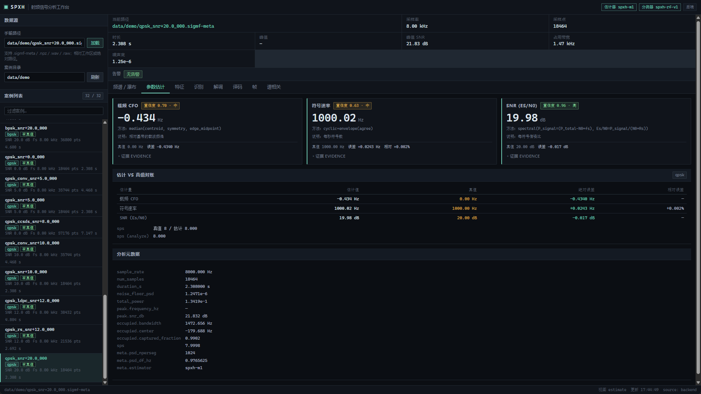

真正的重点不是"算得出来"，而是**每一条都带着 `{value, unit, confidence, method, evidence}`**。

没有依据的数字，这个平台不允许输出——这条规则后面连大模型都一起管住了。

---

## 1. 整条链路是 12 级

从一段裸 I/Q 到可读比特，我把它拆成一条确定性流水线，每一级只干一件事，并把中间量全部暴露出来：

```text
M0 合成/IO → M1 参数估计 → M2 特征+调制识别 → M3 解调/LLR → M4 信道编码
→ M5 帧同步/载荷 → M6 编码链路 → M7 盲编码识别与擦除译码 → M8 谱相关
→ M9 帧头 CRC/盲长度恢复 → M10 LLM 报告 → M11 工具调用代理
→ M12 低信噪比召回与联合译码入链路
```

| 里程碑 | 解决什么 | 实测 |
| --- | --- | --- |
| M0 | 让整条链路可验证：多格式 I/O + 六类调制合成 + 真值 sidecar | 30 dB 的 EVM ≈ 3.1%（纯噪声理论值 3.16%） |
| M1 | 未知 I/Q → 带置信度的参数 | 最差载频误差 10.5 Hz（0.85% Rs）、符号速率相对误差 1.3e-4、Es/N0 误差 0.16 dB |
| M2 | 参数 → 制式 | 识别准确率 1.000 @20 dB / 0.900 @10 dB；概率校准 ECE 0.087 |
| M3 | 制式 → 判决符号与软信息 | QPSK 的 BER 4.95e-1 → 9.2e-4（**537 倍**） |
| M4 | 软信息 → 更可靠的比特 | 软判决相对硬判决 **+2.92 dB @1e-4** |
| M5 | 符号流 → 帧与载荷 | 15 dB 起 BPSK/QPSK **8/8 帧 CRC 通过、载荷逐字节一致** |
| M6/M7 | 编码链接进帧结构，量真实增益 | 无编码 11.20 dB → CCSDS 级联 6.90 dB（**改善 4.30 dB**） |
| M8 | 可解释性：一张看得见的证据 | SSCA α 轴峰 1000.0 Hz（分辨率 31.25 Hz） |
| M9 | 帧头自身的保护 | 五种编码在长度字段被改坏后全部恢复 |
| M10 | LLM 只解释、不编数 | 离线报告正文 **26 个数字全部可溯源** |
| M11 | 让模型自己决定"看什么" | DeepSeek 真机 4 轮 / 9 次工具调用 / 17.2 s，结论数字全部落地 |
| M12 | 低信噪比召回与联合译码 | 卷积链路 6 dB 召回 4 → 10 帧（共 16 帧） |

M1~M8 是"测量与判决"，M9~M12 是"可信与自动化"。

---

## 2. 一级一级看

平台自带一个本地 Web 工作台（`python -m spxh serve`，11 个页签），下面直接用界面截图讲。

### 2.1 频谱 / 瀑布：先看清它长什么样

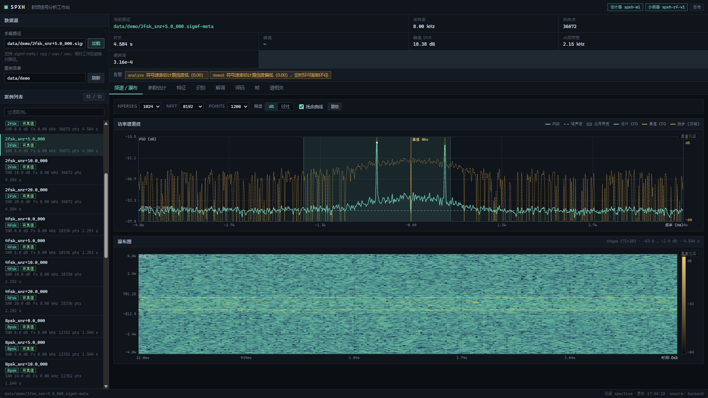

Welch PSD 给出噪声底和占用带宽，STFT 瀑布给出时间维。所有图表都支持**滚轮以鼠标为锚点缩放、Shift 只缩 X / Alt 只缩 Y、拖动平移、双击复位**——看频谱的人对这一点会很敏感，不能缩放等于不能看。

### 2.2 参数估计：没有真值，也要给出置信度


三个估计，每个都是 `{value, unit, confidence, method, evidence}`。

这里有个坑：**平顶谱不能取峰**。信号占了一段带宽，谱是平的，取最大值得到的位置基本是随机噪声决定的。所以载频实际用的是**谱对称性/重心**类判据；符号速率走循环平稳谱线类判据。这些在报告里都写了原因，不是调参调出来的。

### 2.3 特征：把信号变成 23 个可读的数

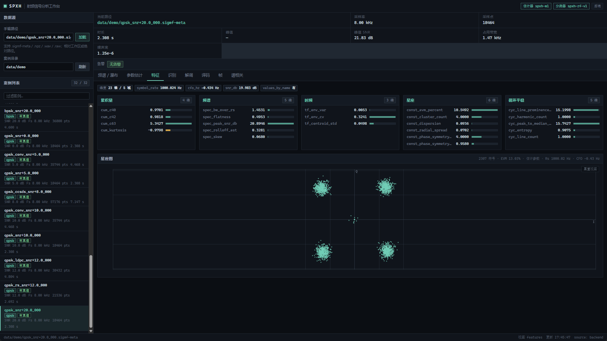

五个域：瞬时统计、谱形状、高阶累积量、星座几何、循环平稳。分成五组可视化，是为了出问题时能一眼看出**是哪一域崩了**，而不是只看到一个准确率。

### 2.4 识别：概率要校准过才叫"置信度"

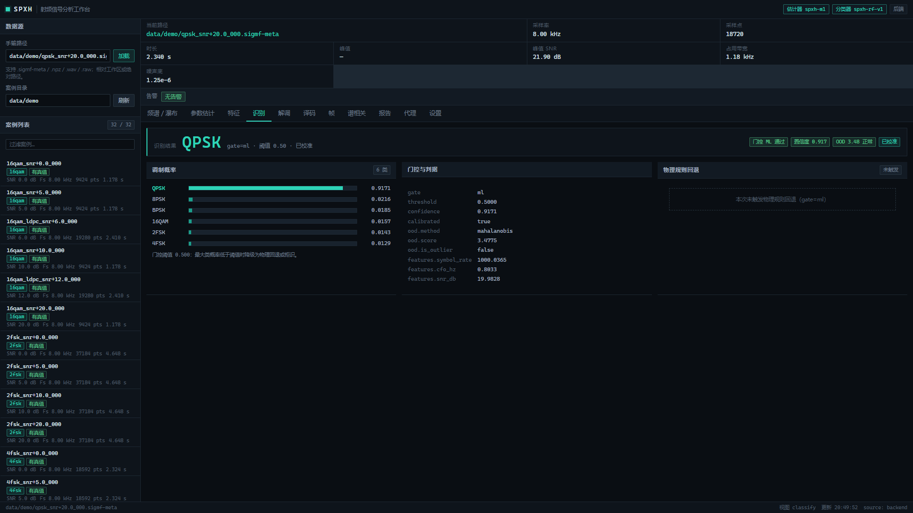

- **门控**：概率不够高就不答（`reject`），或退回物理规则（`fallback`），只有有把握才走机器学习判决（`ml`）；
- **校准**：ECE 0.087 @SNR≥5 dB。界面上的 0.917 是可以当概率读的，不是随机森林吐出来的原始值；
- **OOD**：判断样本是否超出训练分布。

分类器只在合成数据上训练，0 dB 以下基本不可用。这是它的边界，不是 bug。

### 2.5 解调：把"到底锁没锁"画出来

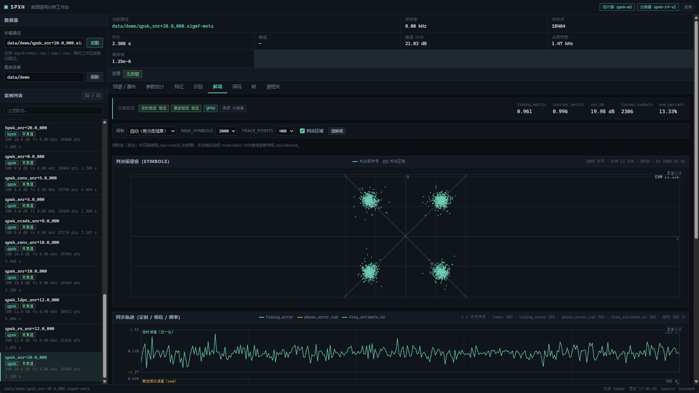

定时环和载波环各自有锁定度量和收敛轨迹。**同步是整条链路最容易"看着像对的其实没锁"的地方**，所以我把锁定指示和轨迹直接摊在界面上，而不是内部消化。

输出是 max-log LLR（约定：正 ⇒ 更可能是 0），一路贯穿到译码器。LLR 还做过校准对账：5 dB 时理论期望误码数 69.5，实测 69，比值 0.99。

### 2.6 译码：软信息到底换回了多少

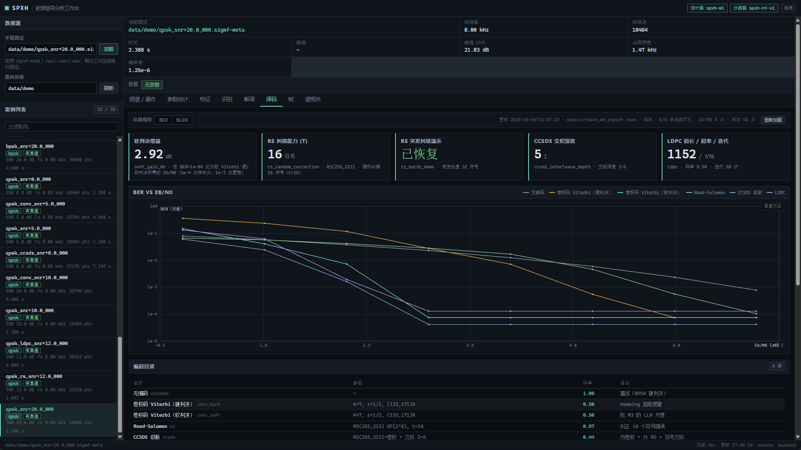

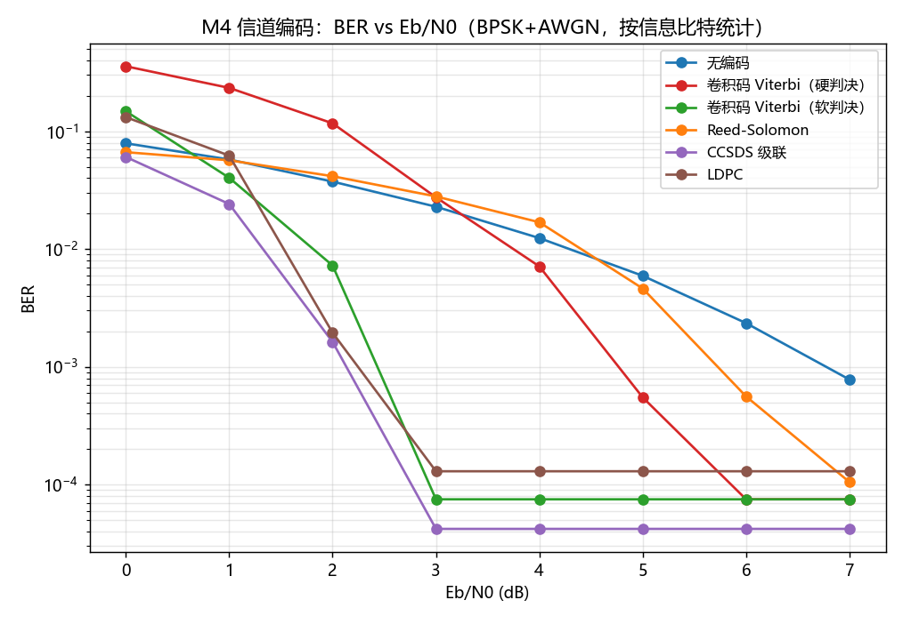

六种方案（交织 / Viterbi / RS / CCSDS 级联 / LDPC / 联合译码）都能编能译，而且都量化了"赚了多少"：

- 软判决 vs 硬判决：**+2.92 dB @ BER=1e-4**；
- 32 符号突发：不交织不可纠，深度 5 符号交织后每码字最多 7 错，**全部纠正**；
- RS(255,223)：纠错上限实测符合理论。

### 2.7 帧同步：从符号流里"认出帧"

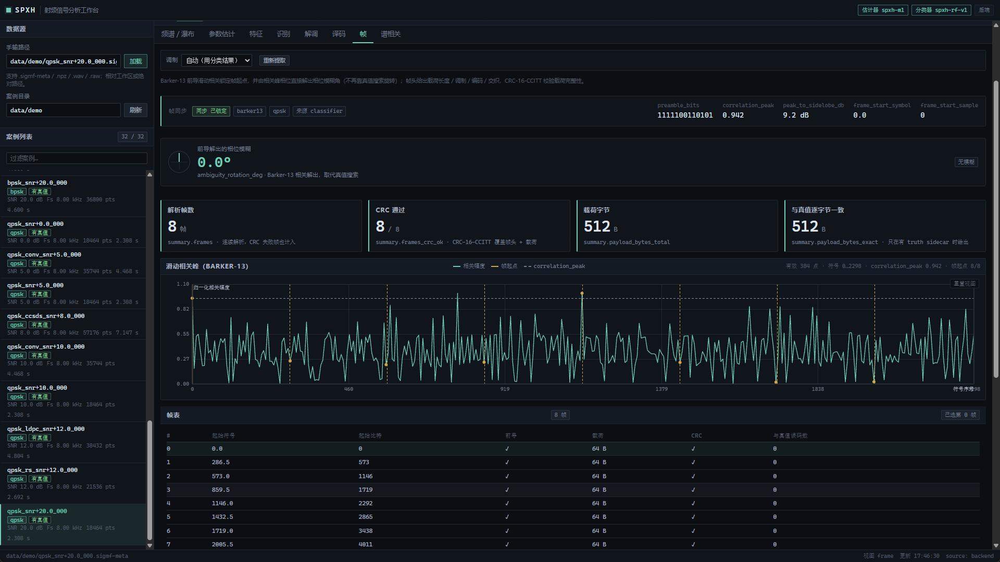

用 Barker-13 前导做相关同步，**解相位模糊**（BPSK 2 种、QPSK 4 种对称旋转都能自纠），解析帧头，校验 CRC-16，取出载荷。同步不用任何真值，只靠前导和帧结构。

15 dB 起 BPSK/QPSK 可以做到 8/8 帧 CRC 通过、载荷逐字节一致。

### 2.8 谱相关：一张"看得见的证据"

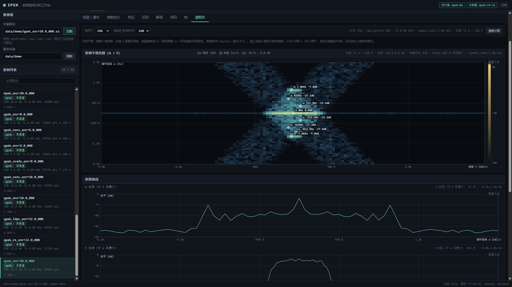

通信信号是循环平稳的，成型脉冲会在 **α = 符号速率及其谐波**处成脊，载频偏移体现在 **f 轴**，而白噪声只在 α=0 有能量。

于是 α 轴峰给出符号速率，α≠0 的脊线位置给出载频偏移——**两条完全独立的证据**。界面上把它们和 M1 的精确估计并排摆着，"两条证据是否一致"一眼可见。

### 2.9 报告：让模型只解释、不估算

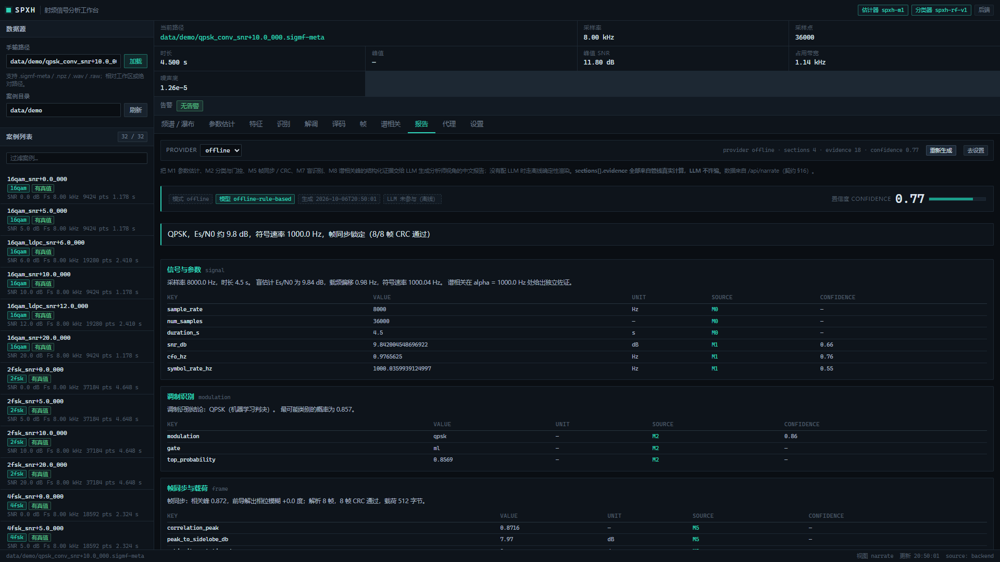

分工很硬：**所有数字来自确定性管线**（带 source/unit/confidence），模型只做解释、整合、找矛盾、给建议。提示词里写死了"只引用给定字段，缺就写 null"，报告生成后还要过一道**数值落地检查**——正文里每个数字都要能在证据表里找到出处。

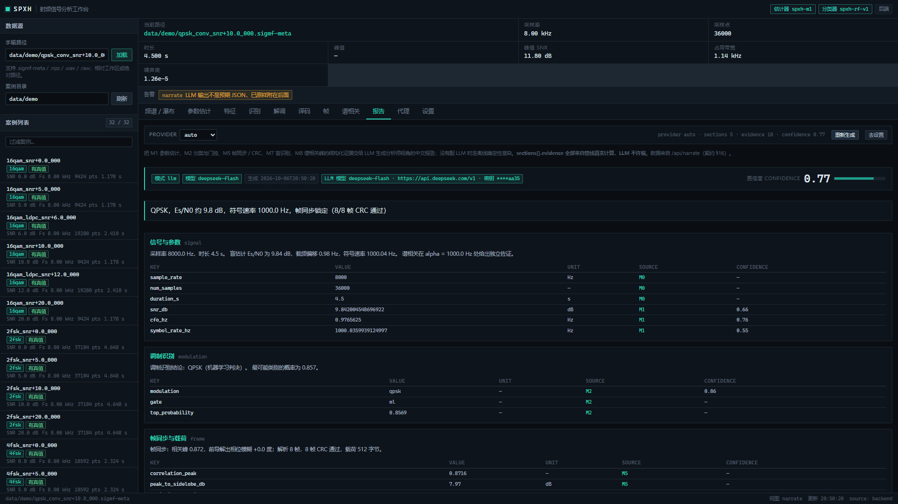

没有 API key 时走**结构完全一致**的离线确定性渲染，也就是上一张图。离线报告实测：正文 26 个数字**全部可溯源**，伪造的数字会被准确标出。

（图 10 那条黄色告警值得看一眼：模型偶尔不守 JSON 契约，平台不会假装成功，而是明确告警并降级——"不编数"这件事，得连失败路径一起诚实。）

### 2.10 代理：让模型自己决定"下一步看什么"

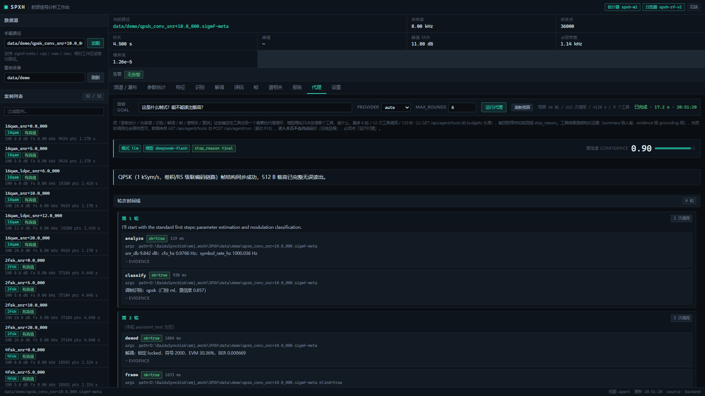

把管线能力暴露成 9 个工具（analyze / classify / spectrum / demod / frame / decode / ssca / batch / cases），模型自主多轮探查，平台硬控预算：

1. **有界**——轮数（6/12）、工具调用（12/24）、墙钟（120/300 s）三重上限，触顶即停并如实回报 `stop_reason`；
2. **防空转**——同工具同参数重复调用直接拒绝；
3. **事实只能来自工具**——结论要过数值落地检查。

上面这次真机跑下来：第 1 轮先拿参数估计和调制识别，第 2 轮自己去调了解调、帧同步、谱相关，第 3 轮自动补了一次 `decode`，最后 4 轮收敛，给出可溯源结论。**这就是代理相对"一次性总结"的价值——它会自己去补证据。**

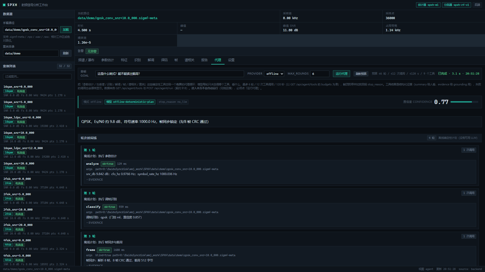

---

## 3. 我踩过的坑（这一段我认为最值钱）

### 3.1 擦除信息值钱的是"位置可信"，不是"置信度低"

我一开始的想法很自然：**LLR 绝对值低 = 这个符号不可信 → 标成擦除，交给 RS 误差+擦除联合译码**（能力从 t 翻到 2t）。

实测打脸：纯 AWGN 下门限**反而变差**，8.78 dB → 9.20 dB。

原因想通了很简单：低 |LLR| 的符号**大多数是正确的**，而每标一个错误的擦除，就要吃掉半个纠错能力。改成"只标连续成段（≥3 符号）的弱区"之后，AWGN 下与不标擦除**逐点相同**、自动擦除数 **0 个**；已知位置的突发（9/12/16 字节）仍然全部通过。

**结论：擦除真正需要的是"位置可信"，不是"置信度低"。**

### 3.2 匹配滤波会把损伤展宽，这是一条硬约束

突发检测（塌陷/压制）做出来之后，我试过在同步侧抗突发：检测到的区间先置零，并在此期间冻结定时/载波环。

机制生效了，但**没有产生帧级增益**。根因是：RRC 匹配滤波把一个 20 符号的洞**展宽到约 36 个符号**的有效损伤，超过 RS(78,62) 的 2t = 16 预算。

于是得到一条硬约束：**有效损伤必须 ≲ 2t，擦除才有用武之地。** 下一步方向也因此明确了——跨码字交织 + 符号级去交织，把 36 个符号的损伤打散到 5 个码字上。

### 3.3 遮挡式置零对 QPSK 其实是"很弱"的损伤

做突发实验时我用"把一段采样置零"模拟遮挡。结果是：**系统看起来很鲁棒**。

这个假象差点骗过我——QPSK 星座点落在固定位置，零点恰好也落在某个固定判决点上，20 个符号里大约只有 8 个真的出错。**用它来证明"系统抗突发"是自欺欺人。** 这组对照我保留在报告里，就是为了提醒自己别被好看的曲线骗。

### 3.4 跨帧积累：试过，放弃了

原计划是"估计帧周期 → 沿 k + jP 做非相干积累，拿 √M 增益"。

两种周期估计器都不可靠：对 |相关| 做自相关，QPSK 的基线不贴近 0，真周期峰被淹没；对显著峰做间隔直方图，被噪声峰污染，估出 **22 / 188 / 2385** 这类值（真值 581 / 290.5 / 1192.5）。

结论：**没有额外先验时，帧周期估计本身就不比帧检测简单。** 这个模块已删除——不留没有实测收益的机制。力气改放到"软前导"，收益直接，还不用改线格式。

### 3.5 低信噪比掉帧，不是相关峰不够高

我一直以为低 SNR 掉帧是因为相关峰太矮。诊断之后发现是**解析阶段要求 13 位 Barker 全对**：BER 2%~5% 时单帧通过率只剩 50%~75%，整帧被丢。

改成软判决（最多容忍 2 位不符 **且** 软相关为正），误判由帧头 CRC-8 和帧 CRC-16 两级兜底。16 帧实测：**卷积链路 6 dB 的召回从 4 帧提到 10 帧**，10 dB 达到 16/16。

这不是放宽判据，是换成更充分利用信息量的判据。

### 3.6 盲编码识别：光改数据不行，必须同时改帧头

帧头里的 `fec` 字段被打错（谎报"无编码"）时，怎么把真实编码认回来？

做法是"假设 → 重写帧头 fec 位 → 用 CRC 校验"。关键点在于：**必须同时修正帧头**，否则 CRC 永远对不上，因为它校验的是被写坏的那个帧头。conv / rs / ccsds / ldpc 四种全部能认回来，载荷一致。

### 3.7 SSCA 的 α 轴差 2 倍

踩坑记录：SSCA 两路频谱各偏 α/2，α 轴尺度算出来差 2 倍。另外 **CFO 不能用 α=0 那一行取峰**——那是平顶功率谱，取出来的是噪声。

### 3.8 报告写着 PASS，复跑却是 FAIL

开源整理时发现 `check_m7.py --part erasure` 复跑失败，而报告写的是通过。

定位结果：**脚本自身的陈旧假设**。里面写死了 `body_start = 13 + 32`（那是 4 字节帧头时代的算法），M9 把帧头改成 5 字节之后，注入的突发落到了错误位置。改成从帧格式常量计算后，复跑 PASS。

这条"不一致"我特意留在报告里不删。**一个项目的可信度，很大程度上取决于它愿不愿意记录自己出过的错。**

### 3.9 真值本身也要被验证

合成链路如果错了，后面所有精度、误码率都是自欺欺人。所以 M0 第一件事就是拿理想参考接收端对账：30 dB 下 EVM 实测约 3.1%，纯噪声理论值 3.16%；实测噪声方差与 Es/N0 定义的最大偏差 < 0.06 dB。

**先证明尺子是准的，再去量东西。**

---

## 4. 我特意保留的"做不到"

这些不是待办清单，是当前版本真实的能力边界：

- **8PSK / 16QAM 存在误码地板。** 来源是同步环残余抖动，不是噪声：QPSK 20 dB 实测 9.2e-4、8PSK 5.4e-3。16QAM 更严重——注入 0.35 符号偏移后 30 dB 仍有 2125 个比特错误，**与噪声无关**，已按实测降级为 known-limit。
- **分类器只在合成数据上训练。** 0 dB 以下基本不可用；OOD 对"同族、只是参数偏移"不敏感；星座特征依赖滚降 0.35 的假设。
- **CCSDS 与 LDPC 不是"标准码"。** CCSDS 保留了级联结构与增益量级，但没实现对偶基/随机化；LDPC 是 Gallager 正则 (1152,578) 短码。**不能与真实设备互操作。**
- **载频精度约 1% Rs。** 够捕获，不够做秒级相干处理——所以 M3 必须有跟踪环。
- **真实信道不在验证范围内。** 所有结果来自合成信号（AWGN/频偏/相噪/IQ 不平衡/DC 偏置）。多径、非线性、非白噪声的真实录波尚未验证。
- **突发检测没有帧级增益。** 检测和链路都可用，但本配置下损伤要么落在 RS 的 t=8 余量内，要么强到连同步环一起打掉。瓶颈在同步环，不在译码器。

把边界写在明面上，比把边界藏在一个漂亮的准确率后面要好。

---

## 5. 想跑起来，四条命令

```bash
pip install -e ".[dev,ml,plot]"       # 核心只要 numpy + scipy

# ① 生成一段带完整真值的信号
python -m spxh generate --mod qpsk --snr 10 --out data/qpsk_snr10

# ② 盲参数估计（有真值会自动对账）
python -m spxh analyze data/demo/qpsk_snr+10.0_000.sigmf-meta

# ③ 帧同步 + 译码 + CRC + 载荷提取，一条命令走完
python -m spxh frame data/demo/qpsk_conv_snr+10.0_000.sigmf-meta --blind

# ④ 打开图形工作台
python -m spxh serve      # http://127.0.0.1:8760/
```

`data/demo/` 里已经内置 **32 个案例**（六类调制 × 四档信噪比 + 编码链路案例），不用先生成就能直接跑。

不联网、没有 GPU、不配大模型，全都能跑：15 个功能里只有"LLM 报告"和"工具调用代理"需要模型，没有 key 时走结构完全一致的离线确定性路径。

---

## 6. 最后

这个项目我最想要的不是"准确率高"，而是**每一句话都能被追问**。

你可以问我"符号速率误差多少"，我可以给你数；你问"这个数怎么来的"，我可以给你脚本；你说"我不信"，你可以自己跑一遍 `python scripts/check_m1.py`，脚本会重新生成表和 JSON，**退出码就是判据**，CI 也在跑。

甚至"实测数据"那张表里的数字都是自动核对过的：脚本把每行数字抽出来，逐个到该行链接的验收报告里查，**25/25 行命中**。

代码是 MIT 协议，纯 Python，31 个测试文件 / 400+ 用例。

> 项目地址：`https://github.com/WmjXiaoJun/SPXH`（占位，发布前替换成真实地址）

如果这篇文章让你觉得"射频信号处理没有想象中那么玄"，那它的目的就达到了——**玄的部分，大部分只是没人愿意把中间量摊开给你看而已。**
